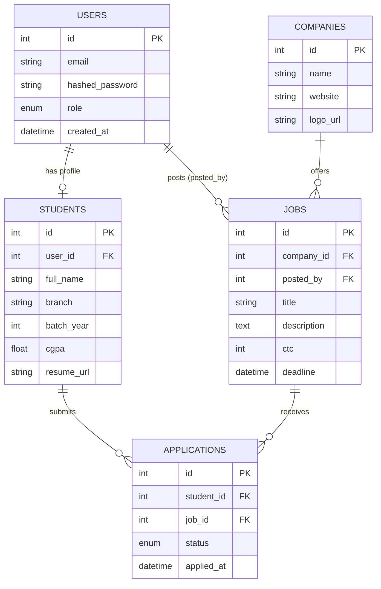

# Entity-Relationship Diagram

```mermaid
erDiagram
    USERS ||--o| STUDENTS : "has profile"
    USERS ||--o{ JOBS : "posts (posted_by)"
    COMPANIES ||--o{ JOBS : "offers"
    STUDENTS ||--o{ APPLICATIONS : "submits"
    JOBS ||--o{ APPLICATIONS : "receives"

    USERS {
        int id PK
        string email
        string hashed_password
        enum role
        datetime created_at
    }
    STUDENTS {
        int id PK
        int user_id FK
        string full_name
        string branch
        int batch_year
        float cgpa
        string resume_url
    }
    COMPANIES {
        int id PK
        string name
        string website
        string logo_url
    }
    JOBS {
        int id PK
        int company_id FK
        int posted_by FK
        string title
        text description
        int ctc
        datetime deadline
    }
    APPLICATIONS {
        int id PK
        int student_id FK
        int job_id FK
        enum status
        datetime applied_at
    }
```